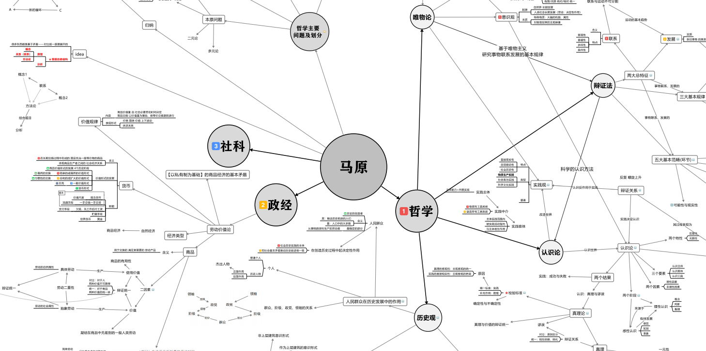
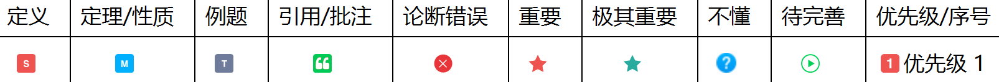

# HITSA飞行器设计/自动化/小卫星本科课程XMind导图笔记

本仓库主要提供【哈工大航天与自动化大类——飞行器设计/自动化/小卫星专业培养方案】所涵盖课程资料，其他专业课程覆盖相对较少。

如资料存在侵权，请及时联系本仓库作者删除。

**注意**：
1. 所有Xmind笔记建议使用Xmind8(update9)打开。
	[Xmind8官方下载链接](https://xmind.cn/download/xmind8/) | [Xmind8破解版](https://pan.baidu.com/s/1pyzwFXT8fLGUVXK60wDOqw?pwd=bkxt)
	(如手头宽裕，请支持正版/doge)
2. 为减小体积，本仓库中提供的教材PDF经过**有损压缩 & OCR文字识别**。若希望获取较高质量教材PDF(未经文字识别)，请前往[网盘下载](https://pan.baidu.com/s/1aoemqyh0sQ92qz_dVLF5ew?pwd=9yv9)

## 培养方案

### 培养方案参考资料

- [2016哈尔滨工业大学本科生培养方案.pdf](%E5%9F%B9%E5%85%BB%E6%96%B9%E6%A1%88/2016%E5%93%88%E5%B0%94%E6%BB%A8%E5%B7%A5%E4%B8%9A%E5%A4%A7%E5%AD%A6%E6%9C%AC%E7%A7%91%E7%94%9F%E5%9F%B9%E5%85%BB%E6%96%B9%E6%A1%88.pdf)
- [电气及自动化.pdf](%E5%9F%B9%E5%85%BB%E6%96%B9%E6%A1%88/%E7%94%B5%E6%B0%94%E5%8F%8A%E8%87%AA%E5%8A%A8%E5%8C%96.pdf)
- [飞行器设计与工程.pdf](%E5%9F%B9%E5%85%BB%E6%96%B9%E6%A1%88/%E9%A3%9E%E8%A1%8C%E5%99%A8%E8%AE%BE%E8%AE%A1%E4%B8%8E%E5%B7%A5%E7%A8%8B.pdf)
- [航天学院自动化.pdf](%E5%9F%B9%E5%85%BB%E6%96%B9%E6%A1%88/%E8%88%AA%E5%A4%A9%E5%AD%A6%E9%99%A2%E8%87%AA%E5%8A%A8%E5%8C%96.pdf)
- [探测制导与控制技术(航天学院自动化).pdf](%E5%9F%B9%E5%85%BB%E6%96%B9%E6%A1%88/%E6%8E%A2%E6%B5%8B%E5%88%B6%E5%AF%BC%E4%B8%8E%E6%8E%A7%E5%88%B6%E6%8A%80%E6%9C%AF(%E8%88%AA%E5%A4%A9%E5%AD%A6%E9%99%A2%E8%87%AA%E5%8A%A8%E5%8C%96).pdf)
- [小卫星班培养方案（2020版讨论稿）.doc](%E5%9F%B9%E5%85%BB%E6%96%B9%E6%A1%88/%E5%B0%8F%E5%8D%AB%E6%98%9F%E7%8F%AD%E5%9F%B9%E5%85%BB%E6%96%B9%E6%A1%88%EF%BC%882020%E7%89%88%E8%AE%A8%E8%AE%BA%E7%A8%BF%EF%BC%89.doc)

### 大一（大类）

秋季学期

- MA21003 微积分 B（1）
- MA21012 代数与几何 B

春季学期

- MA21004 微积分 B（2）
- PH21003 大学物理 B（1）
- CS31901 C 语言程序设计 A
- MX11022 中国近现代史纲要
- EE31018 电路 E（1）

### 自动化

#### 大二

秋季学期

- MX11023 毛泽东思想和中国特色社会主义理论体系概论
- MA21017 概率论与数理统计C
- MA21020 复变函数与积分变换
- PH21004 大学物理 B(2)
- EE31042 电路 E（4）

春季学期

- MX11024 马克思主义基本原理概论
- EE31036 模拟电子技术基础 B
- AS31203 理论力学 C

#### 大三

秋季学期

- EE31035 数字电子技术基础 A
- AS32104 自动控制理论(1)
- AS32105 自动控制实践(1)
- ME31014 机械原理 B

春季学期

- AS32106 自动控制理论(2)
- AS32107 自动控制实践(2)

### 飞设

#### 大二

秋季学期

- MX11023 毛泽东思想和中国特色社会主义理论体系概论
- MA21017 概率论与数理统计C
- MA21020 复变函数与积分变换
- PH21004 大学物理 B(2)
- EE31028 电工与电子技术 B
- AS31202 理论力学 B

春季学期

- MX11024 马克思主义基本原理概论
- AS31204 材料力学 A

#### 大三

秋季学期

- ME31020 机械设计基础 A
- AS31102 自动控制原理 B
- AS32406 飞行器结构力学

春季学期

- AS33411 飞行器结构动力学
- AS32412 航天器姿态动力学与控制
- AS32416 航天器轨道动力学

## 资料引索

### 注意

- 所有资料&笔记均按照上述培养方案课程整理，所有笔记均按照【内容完整性】、【知识有序性】、【语法可读性】进行评估。

	- 内容完整性：作者所认为对于本门课程所涉及的知识覆盖完整性。作者可能在课程中略去某些在其他课程中的重复内容，或因为课程不要求而省略，因此笔记并没有完整记录所有知识。
	- 知识有序性：笔记作者对于导图笔记中知识的结构化程度、逻辑清晰度的主观评价。（部分笔记结构不同于课本可能是因为作者认为书本在内容组织上欠佳）
	- 语法可读性：制作笔记的过程中中作者可能未充分考虑到笔记是否能够被理解，因此不同笔记的语法可读性不尽相同。

- 每门课程一般按照【Xmind笔记】【教材资料】【考试资料】进行整理。

- 笔记图例图标说明

  

### 课程资料评估

| 课程   | 课程名称                   | 内容完整性 | 知识有序性 | 语法可读性 |
| :----: | -------------------------- | :--------: | :--------: | :--------: |
| 数学   | MA2100X 微积分             | ★★★☆☆      | ★★★☆☆      | ★★☆☆☆      |
| 数学   | MA2101X 代数与几何         | ★★★☆☆      | ★★★☆☆      | ★☆☆☆☆      |
| 数学   | MA2101X 概率论与数理统计   | ★★★★★      | ★★★★☆      | ★★★★☆      |
| 数学   | MA21020 复变函数与积分变换 | ★★★★★      | ★★★★☆      | ★★★★☆      |
| 物理   | PH2100X 大学物理           | ★★☆☆☆      | ★★★☆☆      | ★★★☆☆      |
| 物理   | AS3120X 理论力学           | 暂无笔记   | 暂无笔记   | 暂无笔记   |
| 物理   | AS3120X 材料力学           | ★★☆☆☆      | ★★★☆☆      | ★★★☆☆      |
| 物理   | AS32406 飞行器结构力学     | ★★☆☆☆      | ★★★☆☆      | ★★★☆☆      |
| 物理   | 变形体力学重点重构         | ★★★☆☆      | ★★★★★      | ★★★☆☆      |
| 电气   | EE31018 电路E(1)           | ★★★★☆      | ★★★☆☆      | ★★★☆☆      |
| 电气   | EE3103X 模拟电子技术基础   | ★★★★☆      | ★★★★★      | ★★★☆☆      |
| 电气   | EE3103X 数字电子技术基础   | ★★★★☆      | ★★★★★      | ★★★☆☆      |
| 机械   | ME3102X 机械设计基础       | ★★★★☆      | ★★★☆☆      | ★★★☆☆      |
| 计算机 | CS3190X C语言程序设计      | ★★★★★      | ★★★☆☆      | ★★★☆☆      |
| 自动化 | AS32104 自动控制理论(1)    | ★★★★★      | ★★★★★      | ★★★★☆      |
| 自动化 | AS32105 自动控制实践(1)    | ★★★★★      | ★★★★★      | ★★★★☆      |
| 自动化 | AS32106 自动控制理论(2)    | 暂无笔记   | 暂无笔记   | 暂无笔记   |
| 自动化 | AS32107 自动控制实践(2)    | ★★★★★      | ★★★★☆      | ★★★★☆      |
| 飞设 | AS32412 航天器姿态动力学与控制                   | ★★★★☆ | ★★★★☆ | ★★★☆☆ |
| 飞设 | AS32416 航天器轨道动力学                         | ★★★★☆ | ★★★★★ | ★★★★☆ |
| 飞设 | AS33411 飞行器结构动力学                         | ★★★☆☆ | ★★★☆☆ | ★★★☆☆ |
| 思政 | MX11022 中国近现代史纲要                         | ★★★☆☆ | ★★★☆☆ | ★★★☆☆ |
| 思政 | MX11023 毛泽东思想和中国特色社会主义理论体系概论 | ★★★★☆ | ★★★★★ | ★★★★☆ |
| 思政 | MX11024 马克思主义基本原理概论                   | ★★★★☆ | ★★★★★ | ★★★★☆ |

### [01数学](01%E6%95%B0%E5%AD%A6)

- #### [MA2100X 微积分](01%E6%95%B0%E5%AD%A6/MA2100X%20%E5%BE%AE%E7%A7%AF%E5%88%86)

	- 内容完整性★★★☆☆	知识有序性★★★☆☆	语法可读性★★☆☆☆
	- [工科数学分析.xmind](01%E6%95%B0%E5%AD%A6/MA2100X%20%E5%BE%AE%E7%A7%AF%E5%88%86/%E5%B7%A5%E7%A7%91%E6%95%B0%E5%AD%A6%E5%88%86%E6%9E%90.xmind)
	- 教材资料

		- [工科数学分析(上).pdf](01%E6%95%B0%E5%AD%A6/MA2100X%20%E5%BE%AE%E7%A7%AF%E5%88%86/%E5%B7%A5%E7%A7%91%E6%95%B0%E5%AD%A6%E5%88%86%E6%9E%90(%E4%B8%8A).pdf)
		- [工科数学分析(下).pdf](01%E6%95%B0%E5%AD%A6/MA2100X%20%E5%BE%AE%E7%A7%AF%E5%88%86/%E5%B7%A5%E7%A7%91%E6%95%B0%E5%AD%A6%E5%88%86%E6%9E%90(%E4%B8%8B).pdf)
		- [工科数学分析(下)习题解答.pdf](01%E6%95%B0%E5%AD%A6/MA2100X%20%E5%BE%AE%E7%A7%AF%E5%88%86/%E5%B7%A5%E7%A7%91%E6%95%B0%E5%AD%A6%E5%88%86%E6%9E%90(%E4%B8%8B)%E4%B9%A0%E9%A2%98%E8%A7%A3%E7%AD%94.pdf)

	- 考试资料

		- [12-17春季学期工科数学分析历届期末题.pdf](01%E6%95%B0%E5%AD%A6/MA2100X%20%E5%BE%AE%E7%A7%AF%E5%88%86/12-17%E6%98%A5%E5%AD%A3%E5%AD%A6%E6%9C%9F%E5%B7%A5%E7%A7%91%E6%95%B0%E5%AD%A6%E5%88%86%E6%9E%90%E5%8E%86%E5%B1%8A%E6%9C%9F%E6%9C%AB%E9%A2%98.pdf)

- #### [MA2101X 代数与几何](01%E6%95%B0%E5%AD%A6/MA2101X%20%E4%BB%A3%E6%95%B0%E4%B8%8E%E5%87%A0%E4%BD%95)

	- 内容完整性★★★☆☆	知识有序性★★★☆☆	语法可读性★☆☆☆☆
	- [线性代数与空间几何.xmind](01%E6%95%B0%E5%AD%A6/MA2101X%20%E4%BB%A3%E6%95%B0%E4%B8%8E%E5%87%A0%E4%BD%95/%E7%BA%BF%E6%80%A7%E4%BB%A3%E6%95%B0%E4%B8%8E%E7%A9%BA%E9%97%B4%E5%87%A0%E4%BD%95.xmind)
	- 教材资料

		- [[HIT教材]线代第4版答案.pdf](01%E6%95%B0%E5%AD%A6/MA2101X%20%E4%BB%A3%E6%95%B0%E4%B8%8E%E5%87%A0%E4%BD%95/%5BHIT%E6%95%99%E6%9D%90%5D%E7%BA%BF%E4%BB%A3%E7%AC%AC4%E7%89%88%E7%AD%94%E6%A1%88.pdf)
		- [[HIT教材]线性代数与空间解析几何第4版.pdf](01%E6%95%B0%E5%AD%A6/MA2101X%20%E4%BB%A3%E6%95%B0%E4%B8%8E%E5%87%A0%E4%BD%95/%5BHIT%E6%95%99%E6%9D%90%5D%E7%BA%BF%E6%80%A7%E4%BB%A3%E6%95%B0%E4%B8%8E%E7%A9%BA%E9%97%B4%E8%A7%A3%E6%9E%90%E5%87%A0%E4%BD%95%E7%AC%AC4%E7%89%88.pdf)
		- [[HIT教材]线性代数与空间解析几何习题指导.pdf](01%E6%95%B0%E5%AD%A6/MA2101X%20%E4%BB%A3%E6%95%B0%E4%B8%8E%E5%87%A0%E4%BD%95/%5BHIT%E6%95%99%E6%9D%90%5D%E7%BA%BF%E6%80%A7%E4%BB%A3%E6%95%B0%E4%B8%8E%E7%A9%BA%E9%97%B4%E8%A7%A3%E6%9E%90%E5%87%A0%E4%BD%95%E4%B9%A0%E9%A2%98%E6%8C%87%E5%AF%BC.pdf)

- #### [MA2101X 概率论与数理统计](01%E6%95%B0%E5%AD%A6/MA2101X%20%E6%A6%82%E7%8E%87%E8%AE%BA%E4%B8%8E%E6%95%B0%E7%90%86%E7%BB%9F%E8%AE%A1)

	- 内容完整性★★★★★知识有序性★★★★☆	语法可读性★★★★☆
	- [概率论与数理统计.xmind](01%E6%95%B0%E5%AD%A6/MA2101X%20%E6%A6%82%E7%8E%87%E8%AE%BA%E4%B8%8E%E6%95%B0%E7%90%86%E7%BB%9F%E8%AE%A1/%E6%A6%82%E7%8E%87%E8%AE%BA%E4%B8%8E%E6%95%B0%E7%90%86%E7%BB%9F%E8%AE%A1.xmind)
	- 教材资料

		- [[HIT教材]概率论与数理统计 第2版(王勇).pdf](01%E6%95%B0%E5%AD%A6/MA2101X%20%E6%A6%82%E7%8E%87%E8%AE%BA%E4%B8%8E%E6%95%B0%E7%90%86%E7%BB%9F%E8%AE%A1/%5BHIT%E6%95%99%E6%9D%90%5D%E6%A6%82%E7%8E%87%E8%AE%BA%E4%B8%8E%E6%95%B0%E7%90%86%E7%BB%9F%E8%AE%A1%20%E7%AC%AC2%E7%89%88(%E7%8E%8B%E5%8B%87).pdf)
		- [[HIT教材]概率论与数理统计课后习题答案.pdf](01%E6%95%B0%E5%AD%A6/MA2101X%20%E6%A6%82%E7%8E%87%E8%AE%BA%E4%B8%8E%E6%95%B0%E7%90%86%E7%BB%9F%E8%AE%A1/%5BHIT%E6%95%99%E6%9D%90%5D%E6%A6%82%E7%8E%87%E8%AE%BA%E4%B8%8E%E6%95%B0%E7%90%86%E7%BB%9F%E8%AE%A1%E8%AF%BE%E5%90%8E%E4%B9%A0%E9%A2%98%E7%AD%94%E6%A1%88.pdf)

- #### [MA21020 复变函数与积分变换](01%E6%95%B0%E5%AD%A6/MA21020%20%E5%A4%8D%E5%8F%98%E5%87%BD%E6%95%B0%E4%B8%8E%E7%A7%AF%E5%88%86%E5%8F%98%E6%8D%A2)

	- 内容完整性★★★★★	知识有序性★★★★☆	语法可读性★★★★☆
	- [复变函数与积分变换.xmind](01%E6%95%B0%E5%AD%A6/MA21020%20%E5%A4%8D%E5%8F%98%E5%87%BD%E6%95%B0%E4%B8%8E%E7%A7%AF%E5%88%86%E5%8F%98%E6%8D%A2/%E5%A4%8D%E5%8F%98%E5%87%BD%E6%95%B0%E4%B8%8E%E7%A7%AF%E5%88%86%E5%8F%98%E6%8D%A2.xmind)
	- 教材资料

		- [[HIT教材]复变函数与积分变换（第3版）.pdf](01%E6%95%B0%E5%AD%A6/MA21020%20%E5%A4%8D%E5%8F%98%E5%87%BD%E6%95%B0%E4%B8%8E%E7%A7%AF%E5%88%86%E5%8F%98%E6%8D%A2/%5BHIT%E6%95%99%E6%9D%90%5D%E5%A4%8D%E5%8F%98%E5%87%BD%E6%95%B0%E4%B8%8E%E7%A7%AF%E5%88%86%E5%8F%98%E6%8D%A2%EF%BC%88%E7%AC%AC3%E7%89%88%EF%BC%89.pdf)
		- [[HIT教材]复变函数与积分变换习题解答（第3版）.pdf](01%E6%95%B0%E5%AD%A6/MA21020%20%E5%A4%8D%E5%8F%98%E5%87%BD%E6%95%B0%E4%B8%8E%E7%A7%AF%E5%88%86%E5%8F%98%E6%8D%A2/%5BHIT%E6%95%99%E6%9D%90%5D%E5%A4%8D%E5%8F%98%E5%87%BD%E6%95%B0%E4%B8%8E%E7%A7%AF%E5%88%86%E5%8F%98%E6%8D%A2%E4%B9%A0%E9%A2%98%E8%A7%A3%E7%AD%94%EF%BC%88%E7%AC%AC3%E7%89%88%EF%BC%89.pdf)

### [02物理](02%E7%89%A9%E7%90%86)

- #### [PH2100X 大学物理](02%E7%89%A9%E7%90%86/PH2100X%20%E5%A4%A7%E5%AD%A6%E7%89%A9%E7%90%86)

	- 内容完整性★★☆☆☆	知识有序性★★★☆☆	语法可读性★★★☆☆
	- [大学物理.xmind](02%E7%89%A9%E7%90%86/PH2100X%20%E5%A4%A7%E5%AD%A6%E7%89%A9%E7%90%86/%E5%A4%A7%E5%AD%A6%E7%89%A9%E7%90%86.xmind)
	- 教材资料

		- [大学物理学 上册.pdf](02%E7%89%A9%E7%90%86/PH2100X%20%E5%A4%A7%E5%AD%A6%E7%89%A9%E7%90%86/%E9%99%84%E4%BB%B6%E4%B8%80%EF%BC%9A%E5%A4%A7%E5%AD%A6%E7%89%A9%E7%90%86%E5%AD%A6%20%E4%B8%8A%E5%86%8C.pdf)
		- [大学物理学 下册.pdf](02%E7%89%A9%E7%90%86/PH2100X%20%E5%A4%A7%E5%AD%A6%E7%89%A9%E7%90%86/%E9%99%84%E4%BB%B6%E4%BA%8C%EF%BC%9A%E5%A4%A7%E5%AD%A6%E7%89%A9%E7%90%86%E5%AD%A6%20%E4%B8%8B%E5%86%8C.pdf)
		- [大学物理学习题分析与解答 .pdf](02%E7%89%A9%E7%90%86/PH2100X%20%E5%A4%A7%E5%AD%A6%E7%89%A9%E7%90%86/%E9%99%84%E4%BB%B6%E4%B8%89%EF%BC%9A%E5%A4%A7%E5%AD%A6%E7%89%A9%E7%90%86%E5%AD%A6%E4%B9%A0%E9%A2%98%E5%88%86%E6%9E%90%E4%B8%8E%E8%A7%A3%E7%AD%94%20.pdf)

- #### [AS3120X 理论力学](02%E7%89%A9%E7%90%86/AS3120X%20%E7%90%86%E8%AE%BA%E5%8A%9B%E5%AD%A6)

	- 404暂无笔记

- #### [AS3120X 材料力学](02%E7%89%A9%E7%90%86/AS3120X%20%E6%9D%90%E6%96%99%E5%8A%9B%E5%AD%A6)

	- 内容完整性★★☆☆☆	知识有序性★★★☆☆	语法可读性★★★☆☆
	- [新编材料力学.xmind](02%E7%89%A9%E7%90%86/AS3120X%20%E6%9D%90%E6%96%99%E5%8A%9B%E5%AD%A6/%E6%96%B0%E7%BC%96%E6%9D%90%E6%96%99%E5%8A%9B%E5%AD%A6.xmind)
	- 教材资料

		- [[HIT教材]新编材料力学_第3版.pdf](02%E7%89%A9%E7%90%86/AS3120X%20%E6%9D%90%E6%96%99%E5%8A%9B%E5%AD%A6/%5BHIT%E6%95%99%E6%9D%90%5D%E6%96%B0%E7%BC%96%E6%9D%90%E6%96%99%E5%8A%9B%E5%AD%A6_%E7%AC%AC3%E7%89%88.pdf)

- #### [AS32406 飞行器结构力学](02%E7%89%A9%E7%90%86/AS32406%20%E9%A3%9E%E8%A1%8C%E5%99%A8%E7%BB%93%E6%9E%84%E5%8A%9B%E5%AD%A6)

	- 内容完整性★★☆☆☆	知识有序性★★★☆☆	语法可读性★★★☆☆
	- [结构力学.xmind](02%E7%89%A9%E7%90%86/AS32406%20%E9%A3%9E%E8%A1%8C%E5%99%A8%E7%BB%93%E6%9E%84%E5%8A%9B%E5%AD%A6/%E7%BB%93%E6%9E%84%E5%8A%9B%E5%AD%A6.xmind)
	- 教材资料

		- [[HIT教材]结构力学(第三版)王焕定.pdf](02%E7%89%A9%E7%90%86/AS32406%20%E9%A3%9E%E8%A1%8C%E5%99%A8%E7%BB%93%E6%9E%84%E5%8A%9B%E5%AD%A6/%5BHIT%E6%95%99%E6%9D%90%5D%E7%BB%93%E6%9E%84%E5%8A%9B%E5%AD%A6(%E7%AC%AC%E4%B8%89%E7%89%88)%E7%8E%8B%E7%84%95%E5%AE%9A.pdf)

- #### [变形体力学重点重构](02%E7%89%A9%E7%90%86/%E5%8F%98%E5%BD%A2%E4%BD%93%E5%8A%9B%E5%AD%A6%E9%87%8D%E7%82%B9%E9%87%8D%E6%9E%84.xmind)

	- 内容完整性★★★☆☆	知识有序性★★★★★	语法可读性★★★☆☆
重新整理的力学重点内容，包括材料力学、结构力学以及部分弹性力学。

### [03电气](03%E7%94%B5%E6%B0%94)

- #### [EE31018 电路E(1)](03%E7%94%B5%E6%B0%94/EE31018%20%E7%94%B5%E8%B7%AFE(1))

	- 内容完整性★★★★☆	知识有序性★★★☆☆	语法可读性★★★☆☆
	- [电路基础理论.xmind](03%E7%94%B5%E6%B0%94/EE31018%20%E7%94%B5%E8%B7%AFE(1)/%E7%94%B5%E8%B7%AF%E5%9F%BA%E7%A1%80%E7%90%86%E8%AE%BA.xmind)
	- 教材资料

		- [电路理论基础.pdf](03%E7%94%B5%E6%B0%94/EE31018%20%E7%94%B5%E8%B7%AFE(1)/%E7%94%B5%E8%B7%AF%E7%90%86%E8%AE%BA%E5%9F%BA%E7%A1%80.pdf)

- #### [EE3103X 模拟电子技术基础](03%E7%94%B5%E6%B0%94/EE3103X%20%E6%A8%A1%E6%8B%9F%E7%94%B5%E5%AD%90%E6%8A%80%E6%9C%AF%E5%9F%BA%E7%A1%80)

	- 内容完整性★★★★☆	知识有序性★★★★★	语法可读性★★★☆☆
	- [模拟电路.xmind](03%E7%94%B5%E6%B0%94/EE3103X%20%E6%A8%A1%E6%8B%9F%E7%94%B5%E5%AD%90%E6%8A%80%E6%9C%AF%E5%9F%BA%E7%A1%80/%E6%A8%A1%E6%8B%9F%E7%94%B5%E8%B7%AF.xmind)
	- 教材资料

		- [[HIT教材]模拟电子技术基础.pdf](03%E7%94%B5%E6%B0%94/EE3103X%20%E6%A8%A1%E6%8B%9F%E7%94%B5%E5%AD%90%E6%8A%80%E6%9C%AF%E5%9F%BA%E7%A1%80/%5BHIT%E6%95%99%E6%9D%90%5D%E6%A8%A1%E6%8B%9F%E7%94%B5%E5%AD%90%E6%8A%80%E6%9C%AF%E5%9F%BA%E7%A1%80.pdf)

- #### [EE3103X 数字电子技术基础](03%E7%94%B5%E6%B0%94/EE3103X%20%E6%95%B0%E5%AD%97%E7%94%B5%E5%AD%90%E6%8A%80%E6%9C%AF%E5%9F%BA%E7%A1%80)

	- 内容完整性★★★★☆	知识有序性★★★★★	语法可读性★★★☆☆
	- [数字电路.xmind](03%E7%94%B5%E6%B0%94/EE3103X%20%E6%95%B0%E5%AD%97%E7%94%B5%E5%AD%90%E6%8A%80%E6%9C%AF%E5%9F%BA%E7%A1%80/%E6%95%B0%E5%AD%97%E7%94%B5%E8%B7%AF.xmind)
	- 教材资料

		- [数字电子技术基础（第二版）.pdf](03%E7%94%B5%E6%B0%94/EE3103X%20%E6%95%B0%E5%AD%97%E7%94%B5%E5%AD%90%E6%8A%80%E6%9C%AF%E5%9F%BA%E7%A1%80/%E6%95%B0%E5%AD%97%E7%94%B5%E5%AD%90%E6%8A%80%E6%9C%AF%E5%9F%BA%E7%A1%80_%E7%AC%AC%E4%BA%8C%E7%89%88.pdf)

### [04机械](04%E6%9C%BA%E6%A2%B0)

- #### [ME3102X 机械设计基础](04%E6%9C%BA%E6%A2%B0/ME3102X%20%E6%9C%BA%E6%A2%B0%E8%AE%BE%E8%AE%A1%E5%9F%BA%E7%A1%80)

	- 内容完整性★★★★☆	知识有序性★★★☆☆	语法可读性★★★☆☆
	- [机械原理.xmind](04%E6%9C%BA%E6%A2%B0/ME3102X%20%E6%9C%BA%E6%A2%B0%E8%AE%BE%E8%AE%A1%E5%9F%BA%E7%A1%80/%E6%9C%BA%E6%A2%B0%E5%8E%9F%E7%90%86.xmind)
	- 教材资料

		- [机械设计基础 第5版 敖宏瑞 王瑜.pdf](04%E6%9C%BA%E6%A2%B0/ME3102X%20%E6%9C%BA%E6%A2%B0%E8%AE%BE%E8%AE%A1%E5%9F%BA%E7%A1%80/%E6%9C%BA%E6%A2%B0%E8%AE%BE%E8%AE%A1%E5%9F%BA%E7%A1%80%20%E7%AC%AC5%E7%89%88%20%E6%95%96%E5%AE%8F%E7%91%9E%20%E7%8E%8B%E7%91%9C.pdf)

### [05计算机](05%E8%AE%A1%E7%AE%97%E6%9C%BA)

- #### [CS3190X C语言程序设计](05%E8%AE%A1%E7%AE%97%E6%9C%BA/CS3190X%20C%E8%AF%AD%E8%A8%80%E7%A8%8B%E5%BA%8F%E8%AE%BE%E8%AE%A1)

	- 内容完整性★★★★★	知识有序性★★★☆☆	语法可读性★★★☆☆
	- [C语言程序设计.xmind](05%E8%AE%A1%E7%AE%97%E6%9C%BA/CS3190X%20C%E8%AF%AD%E8%A8%80%E7%A8%8B%E5%BA%8F%E8%AE%BE%E8%AE%A1/C%E8%AF%AD%E8%A8%80%E7%A8%8B%E5%BA%8F%E8%AE%BE%E8%AE%A1.xmind)
	- 教材资料

		- [[HIT教材]C语言程序设计  第3版 苏小红.pdf](05%E8%AE%A1%E7%AE%97%E6%9C%BA/CS3190X%20C%E8%AF%AD%E8%A8%80%E7%A8%8B%E5%BA%8F%E8%AE%BE%E8%AE%A1/%5BHIT%E6%95%99%E6%9D%90%5DC%E8%AF%AD%E8%A8%80%E7%A8%8B%E5%BA%8F%E8%AE%BE%E8%AE%A1%20%20%E7%AC%AC3%E7%89%88%20%E4%BD%9C%E8%80%85%E8%8B%8F%E5%B0%8F%E7%BA%A2%EF%BC%8C%E7%8E%8B%E5%AE%87%E9%A2%96%EF%BC%8C%E5%AD%99%E5%BF%97%E5%B2%97%E7%AD%89%E7%BC%96%E8%91%97%EF%BC%9B%E8%92%8B%E5%AE%97%E7%A4%BC%E4%B8%BB%E5%AE%A1%20%20%E9%A1%B5%E6%95%B0414%20%20%E5%87%BA%E7%89%88%E7%A4%BE%E5%8C%97%E4%BA%AC%EF%BC%9A%E9%AB%98%E7%AD%89%E6%95%99%E8%82%B2%E5%87%BA%E7%89%88%E7%A4%BE.pdf)

### [06自动化](06%E8%87%AA%E5%8A%A8%E5%8C%96)

- #### [AS32104 自动控制理论(1)](06%E8%87%AA%E5%8A%A8%E5%8C%96/AS32104%20%E8%87%AA%E5%8A%A8%E6%8E%A7%E5%88%B6%E7%90%86%E8%AE%BA(1))

	- 内容完整性★★★★★	知识有序性★★★★★	语法可读性★★★★☆
	- [自动控制.xmind](06%E8%87%AA%E5%8A%A8%E5%8C%96/AS32104%20%E8%87%AA%E5%8A%A8%E6%8E%A7%E5%88%B6%E7%90%86%E8%AE%BA(1)/%E8%87%AA%E5%8A%A8%E6%8E%A7%E5%88%B6.xmind)
	- 教材资料

		- [[HIT教材]自动控制原理 上(带标签).pdf](06%E8%87%AA%E5%8A%A8%E5%8C%96/AS32104%20%E8%87%AA%E5%8A%A8%E6%8E%A7%E5%88%B6%E7%90%86%E8%AE%BA(1)/%5BHIT%E6%95%99%E6%9D%90%5D%E8%87%AA%E5%8A%A8%E6%8E%A7%E5%88%B6%E5%8E%9F%E7%90%86%20%E4%B8%8A(%E5%B8%A6%E6%A0%87%E7%AD%BE).pdf)
		- [[HIT教材]自动控制原理 下.pdf](06%E8%87%AA%E5%8A%A8%E5%8C%96/AS32104%20%E8%87%AA%E5%8A%A8%E6%8E%A7%E5%88%B6%E7%90%86%E8%AE%BA(1)/%5BHIT%E6%95%99%E6%9D%90%5D%E8%87%AA%E5%8A%A8%E6%8E%A7%E5%88%B6%E5%8E%9F%E7%90%86%20%E4%B8%8B.pdf)
		- [自控原理 课后题答案.zip](06%E8%87%AA%E5%8A%A8%E5%8C%96/AS32104%20%E8%87%AA%E5%8A%A8%E6%8E%A7%E5%88%B6%E7%90%86%E8%AE%BA(1)/%E8%87%AA%E6%8E%A7%E5%8E%9F%E7%90%86%20%E8%AF%BE%E5%90%8E%E9%A2%98%E7%AD%94%E6%A1%88.zip)

- #### [AS32105 自动控制实践(1)](06%E8%87%AA%E5%8A%A8%E5%8C%96/AS32105%20%E8%87%AA%E5%8A%A8%E6%8E%A7%E5%88%B6%E5%AE%9E%E8%B7%B5(1))

	- 内容完整性★★★★★	知识有序性★★★★★	语法可读性★★★★☆
	- [自动控制元件与线路.xmind](06%E8%87%AA%E5%8A%A8%E5%8C%96/AS32105%20%E8%87%AA%E5%8A%A8%E6%8E%A7%E5%88%B6%E5%AE%9E%E8%B7%B5(1)/%E8%87%AA%E5%8A%A8%E6%8E%A7%E5%88%B6%E5%85%83%E4%BB%B6%E4%B8%8E%E7%BA%BF%E8%B7%AF.xmind)
	- [自控元件重构.xmind](06%E8%87%AA%E5%8A%A8%E5%8C%96/AS32105%20%E8%87%AA%E5%8A%A8%E6%8E%A7%E5%88%B6%E5%AE%9E%E8%B7%B5(1)/%E8%87%AA%E6%8E%A7%E5%85%83%E4%BB%B6%E9%87%8D%E6%9E%84.xmind)
	- 教材资料

		- [课件(赵辉)](06%E8%87%AA%E5%8A%A8%E5%8C%96/AS32105%20%E8%87%AA%E5%8A%A8%E6%8E%A7%E5%88%B6%E5%AE%9E%E8%B7%B5(1)/%E8%AF%BE%E4%BB%B6(%E8%B5%B5%E8%BE%89))
		- [自动控制元件及线路.pdf](06%E8%87%AA%E5%8A%A8%E5%8C%96/AS32105%20%E8%87%AA%E5%8A%A8%E6%8E%A7%E5%88%B6%E5%AE%9E%E8%B7%B5(1)/%E8%87%AA%E5%8A%A8%E6%8E%A7%E5%88%B6%E5%85%83%E4%BB%B6%E5%8F%8A%E7%BA%BF%E8%B7%AF.pdf)

	- 考试资料

		- [试卷真题](06%E8%87%AA%E5%8A%A8%E5%8C%96/AS32105%20%E8%87%AA%E5%8A%A8%E6%8E%A7%E5%88%B6%E5%AE%9E%E8%B7%B5(1)/%E8%AF%95%E5%8D%B7%E7%9C%9F%E9%A2%98)

- #### [AS32106 自动控制理论(2)](06%E8%87%AA%E5%8A%A8%E5%8C%96/AS32106%20%E8%87%AA%E5%8A%A8%E6%8E%A7%E5%88%B6%E7%90%86%E8%AE%BA(2))

	- 还没上完 敬请期待

- #### [AS32107 自动控制实践(2)](06%E8%87%AA%E5%8A%A8%E5%8C%96/AS32107%20%E8%87%AA%E5%8A%A8%E6%8E%A7%E5%88%B6%E5%AE%9E%E8%B7%B5(2))

	- 内容完整性★★★★★	知识有序性★★★★☆	语法可读性★★★★☆
	- [控制系统设计.xmind](06%E8%87%AA%E5%8A%A8%E5%8C%96/AS32107%20%E8%87%AA%E5%8A%A8%E6%8E%A7%E5%88%B6%E5%AE%9E%E8%B7%B5(2)/%E6%8E%A7%E5%88%B6%E7%B3%BB%E7%BB%9F%E8%AE%BE%E8%AE%A1.xmind)
	- 教材资料

		- [控制系统设计PPT(2023)(陈松林)](06%E8%87%AA%E5%8A%A8%E5%8C%96/AS32107%20%E8%87%AA%E5%8A%A8%E6%8E%A7%E5%88%B6%E5%AE%9E%E8%B7%B5(2)/%E6%8E%A7%E5%88%B6%E7%B3%BB%E7%BB%9F%E8%AE%BE%E8%AE%A1PPT(2023))
		- [控制系统设计(何朕)增强版.pdf](06%E8%87%AA%E5%8A%A8%E5%8C%96/AS32107%20%E8%87%AA%E5%8A%A8%E6%8E%A7%E5%88%B6%E5%AE%9E%E8%B7%B5(2)/%E6%8E%A7%E5%88%B6%E7%B3%BB%E7%BB%9F%E8%AE%BE%E8%AE%A1(%E4%BD%95%E6%9C%95)%E5%A2%9E%E5%BC%BA%E7%89%88.pdf)

	- 考试资料

		- [2020考试真题](06%E8%87%AA%E5%8A%A8%E5%8C%96/AS32107%20%E8%87%AA%E5%8A%A8%E6%8E%A7%E5%88%B6%E5%AE%9E%E8%B7%B5(2)/2020%E8%80%83%E8%AF%95%E7%9C%9F%E9%A2%98)

### [07飞设](07%E9%A3%9E%E8%AE%BE)

- #### [AS32412 航天器姿态动力学与控制](07%E9%A3%9E%E8%AE%BE/AS32412%20%E8%88%AA%E5%A4%A9%E5%99%A8%E5%A7%BF%E6%80%81%E5%8A%A8%E5%8A%9B%E5%AD%A6%E4%B8%8E%E6%8E%A7%E5%88%B6)

  - 内容完整性★★★★☆	知识有序性★★★★☆	语法可读性★★★☆☆
  - [姿态动力学.xmind](/07%E9%A3%9E%E8%AE%BE/AS32412%20%E8%88%AA%E5%A4%A9%E5%99%A8%E5%A7%BF%E6%80%81%E5%8A%A8%E5%8A%9B%E5%AD%A6%E4%B8%8E%E6%8E%A7%E5%88%B6/%E5%A7%BF%E6%80%81%E5%8A%A8%E5%8A%9B%E5%AD%A6.xmind)
  - 教材资料

  	- [课件(耿云海)](07%E9%A3%9E%E8%AE%BE/AS32412%20%E8%88%AA%E5%A4%A9%E5%99%A8%E5%A7%BF%E6%80%81%E5%8A%A8%E5%8A%9B%E5%AD%A6%E4%B8%8E%E6%8E%A7%E5%88%B6/%E8%AF%BE%E4%BB%B6(%E8%80%BF%E4%BA%91%E6%B5%B7))
  	  - 版权问题，已下架
  	- [航天器姿态动力学与控制-教材原始版2012.pdf](/07%E9%A3%9E%E8%AE%BE/AS32412%20%E8%88%AA%E5%A4%A9%E5%99%A8%E5%A7%BF%E6%80%81%E5%8A%A8%E5%8A%9B%E5%AD%A6%E4%B8%8E%E6%8E%A7%E5%88%B6/%E8%88%AA%E5%A4%A9%E5%99%A8%E5%A7%BF%E6%80%81%E5%8A%A8%E5%8A%9B%E5%AD%A6%E4%B8%8E%E6%8E%A7%E5%88%B6-%E6%95%99%E6%9D%90%E5%8E%9F%E5%A7%8B%E7%89%882012.pdf)

- #### [AS32416 航天器轨道动力学](07%E9%A3%9E%E8%AE%BE/AS32416%20%E8%88%AA%E5%A4%A9%E5%99%A8%E8%BD%A8%E9%81%93%E5%8A%A8%E5%8A%9B%E5%AD%A6)

	- 内容完整性★★★★☆	知识有序性★★★★★	语法可读性★★★★☆
	- [The Map of Orbit Dynamics.pdf](/07%E9%A3%9E%E8%AE%BE/AS32416%20%E8%88%AA%E5%A4%A9%E5%99%A8%E8%BD%A8%E9%81%93%E5%8A%A8%E5%8A%9B%E5%AD%A6/The%20Map%20of%20Orbit%20Dynamics.pdf)
	- [轨道动力学.xmind](07%E9%A3%9E%E8%AE%BE/AS32416%20%E8%88%AA%E5%A4%A9%E5%99%A8%E8%BD%A8%E9%81%93%E5%8A%A8%E5%8A%9B%E5%AD%A6/%E8%BD%A8%E9%81%93%E5%8A%A8%E5%8A%9B%E5%AD%A6.xmind)
	- 教材资料

		- [课件(张刚)](07%E9%A3%9E%E8%AE%BE/AS32416%20%E8%88%AA%E5%A4%A9%E5%99%A8%E8%BD%A8%E9%81%93%E5%8A%A8%E5%8A%9B%E5%AD%A6/%E8%AF%BE%E4%BB%B6(%E5%BC%A0%E5%88%9A))
		- 版权问题，已下架
		
	- [航天器轨道动力学 赵钧.pdf](07%E9%A3%9E%E8%AE%BE/AS32416%20%E8%88%AA%E5%A4%A9%E5%99%A8%E8%BD%A8%E9%81%93%E5%8A%A8%E5%8A%9B%E5%AD%A6/%E8%88%AA%E5%A4%A9%E5%99%A8%E8%BD%A8%E9%81%93%E5%8A%A8%E5%8A%9B%E5%AD%A6%20%E8%B5%B5%E9%92%A7.pdf)
	
- #### [AS33411 飞行器结构动力学](07%E9%A3%9E%E8%AE%BE/AS33411%20%E9%A3%9E%E8%A1%8C%E5%99%A8%E7%BB%93%E6%9E%84%E5%8A%A8%E5%8A%9B%E5%AD%A6)

	- 内容完整性★★★☆☆	知识有序性★★★☆☆	语法可读性★★★☆☆
	- [飞行器结构动力学.xmind](07%E9%A3%9E%E8%AE%BE/AS33411%20%E9%A3%9E%E8%A1%8C%E5%99%A8%E7%BB%93%E6%9E%84%E5%8A%A8%E5%8A%9B%E5%AD%A6/%E9%A3%9E%E8%A1%8C%E5%99%A8%E7%BB%93%E6%9E%84%E5%8A%A8%E5%8A%9B%E5%AD%A6.xmind)
	- 教材资料

		- [[HIT]结构动力学(于开平)(增强版).pdf](07%E9%A3%9E%E8%AE%BE/AS33411%20%E9%A3%9E%E8%A1%8C%E5%99%A8%E7%BB%93%E6%9E%84%E5%8A%A8%E5%8A%9B%E5%AD%A6/%5BHIT%5D%E7%BB%93%E6%9E%84%E5%8A%A8%E5%8A%9B%E5%AD%A6(%E4%BA%8E%E5%BC%80%E5%B9%B3)(%E5%A2%9E%E5%BC%BA%E7%89%88).pdf)
		- 教材

			- [HIT]结构动力学(于开平)

				- 978-7-5603-5059-2

### [08思政](08%E6%80%9D%E6%94%BF)

- #### [MX11022 中国近现代史纲要](08%E6%80%9D%E6%94%BF/MX11022%20%E4%B8%AD%E5%9B%BD%E8%BF%91%E7%8E%B0%E4%BB%A3%E5%8F%B2%E7%BA%B2%E8%A6%81)

	- 内容完整性★★★☆☆	知识有序性★★★☆☆	语法可读性★★★☆☆
	- [中国近纲.xmind](08%E6%80%9D%E6%94%BF/MX11022%20%E4%B8%AD%E5%9B%BD%E8%BF%91%E7%8E%B0%E4%BB%A3%E5%8F%B2%E7%BA%B2%E8%A6%81/%E4%B8%AD%E5%9B%BD%E8%BF%91%E7%BA%B2.xmind)
	- 教材资料

		- [[HIT教材]史纲新教材（18版）.pdf](08%E6%80%9D%E6%94%BF/MX11022%20%E4%B8%AD%E5%9B%BD%E8%BF%91%E7%8E%B0%E4%BB%A3%E5%8F%B2%E7%BA%B2%E8%A6%81/%5BHIT%E6%95%99%E6%9D%90%5D%E5%8F%B2%E7%BA%B2%E6%96%B0%E6%95%99%E6%9D%90%EF%BC%8818%E7%89%88%EF%BC%89.pdf)

- #### [MX11023 毛泽东思想和中国特色社会主义理论体系概论](08%E6%80%9D%E6%94%BF/MX11023%20%E6%AF%9B%E6%B3%BD%E4%B8%9C%E6%80%9D%E6%83%B3%E5%92%8C%E4%B8%AD%E5%9B%BD%E7%89%B9%E8%89%B2%E7%A4%BE%E4%BC%9A%E4%B8%BB%E4%B9%89%E7%90%86%E8%AE%BA%E4%BD%93%E7%B3%BB%E6%A6%82%E8%AE%BA)

	- 内容完整性★★★★☆	知识有序性★★★★★	语法可读性★★★★☆
	- [毛概.xmind](08%E6%80%9D%E6%94%BF/MX11023%20%E6%AF%9B%E6%B3%BD%E4%B8%9C%E6%80%9D%E6%83%B3%E5%92%8C%E4%B8%AD%E5%9B%BD%E7%89%B9%E8%89%B2%E7%A4%BE%E4%BC%9A%E4%B8%BB%E4%B9%89%E7%90%86%E8%AE%BA%E4%BD%93%E7%B3%BB%E6%A6%82%E8%AE%BA/%E6%AF%9B%E6%A6%82.xmind)
	- [毛概重点整理(ZHY).xmind](08%E6%80%9D%E6%94%BF/MX11023%20%E6%AF%9B%E6%B3%BD%E4%B8%9C%E6%80%9D%E6%83%B3%E5%92%8C%E4%B8%AD%E5%9B%BD%E7%89%B9%E8%89%B2%E7%A4%BE%E4%BC%9A%E4%B8%BB%E4%B9%89%E7%90%86%E8%AE%BA%E4%BD%93%E7%B3%BB%E6%A6%82%E8%AE%BA/%E6%AF%9B%E6%A6%82%E9%87%8D%E7%82%B9%E6%95%B4%E7%90%86(ZHY).xmind)
	- 教材资料

		- [01 毛中特教材2018(重点标注).docx](08%E6%80%9D%E6%94%BF/MX11023%20%E6%AF%9B%E6%B3%BD%E4%B8%9C%E6%80%9D%E6%83%B3%E5%92%8C%E4%B8%AD%E5%9B%BD%E7%89%B9%E8%89%B2%E7%A4%BE%E4%BC%9A%E4%B8%BB%E4%B9%89%E7%90%86%E8%AE%BA%E4%BD%93%E7%B3%BB%E6%A6%82%E8%AE%BA/01%20%E6%AF%9B%E4%B8%AD%E7%89%B9%E6%95%99%E6%9D%902018(%E9%87%8D%E7%82%B9%E6%A0%87%E6%B3%A8).docx)
		- [02《毛中特》2018版重点整理.pdf](08%E6%80%9D%E6%94%BF/MX11023%20%E6%AF%9B%E6%B3%BD%E4%B8%9C%E6%80%9D%E6%83%B3%E5%92%8C%E4%B8%AD%E5%9B%BD%E7%89%B9%E8%89%B2%E7%A4%BE%E4%BC%9A%E4%B8%BB%E4%B9%89%E7%90%86%E8%AE%BA%E4%BD%93%E7%B3%BB%E6%A6%82%E8%AE%BA/02%E3%80%8A%E6%AF%9B%E4%B8%AD%E7%89%B9%E3%80%8B2018%E7%89%88%E9%87%8D%E7%82%B9%E6%95%B4%E7%90%86.pdf)
		- [03 毛概笔记.pdf](08%E6%80%9D%E6%94%BF/MX11023%20%E6%AF%9B%E6%B3%BD%E4%B8%9C%E6%80%9D%E6%83%B3%E5%92%8C%E4%B8%AD%E5%9B%BD%E7%89%B9%E8%89%B2%E7%A4%BE%E4%BC%9A%E4%B8%BB%E4%B9%89%E7%90%86%E8%AE%BA%E4%BD%93%E7%B3%BB%E6%A6%82%E8%AE%BA/03%20%E6%AF%9B%E6%A6%82%E7%AC%94%E8%AE%B0.pdf)
		- [04 毛概2021考点解析.pdf](08%E6%80%9D%E6%94%BF/MX11023%20%E6%AF%9B%E6%B3%BD%E4%B8%9C%E6%80%9D%E6%83%B3%E5%92%8C%E4%B8%AD%E5%9B%BD%E7%89%B9%E8%89%B2%E7%A4%BE%E4%BC%9A%E4%B8%BB%E4%B9%89%E7%90%86%E8%AE%BA%E4%BD%93%E7%B3%BB%E6%A6%82%E8%AE%BA/04%20%E6%AF%9B%E6%A6%822021%E8%80%83%E7%82%B9%E8%A7%A3%E6%9E%90.pdf)
		- [05 选择题.pdf](08%E6%80%9D%E6%94%BF/MX11023%20%E6%AF%9B%E6%B3%BD%E4%B8%9C%E6%80%9D%E6%83%B3%E5%92%8C%E4%B8%AD%E5%9B%BD%E7%89%B9%E8%89%B2%E7%A4%BE%E4%BC%9A%E4%B8%BB%E4%B9%89%E7%90%86%E8%AE%BA%E4%BD%93%E7%B3%BB%E6%A6%82%E8%AE%BA/05%20%E9%80%89%E6%8B%A9%E9%A2%98.pdf)
		- [06 08年版毛概题库(附答案).pdf](08%E6%80%9D%E6%94%BF/MX11023%20%E6%AF%9B%E6%B3%BD%E4%B8%9C%E6%80%9D%E6%83%B3%E5%92%8C%E4%B8%AD%E5%9B%BD%E7%89%B9%E8%89%B2%E7%A4%BE%E4%BC%9A%E4%B8%BB%E4%B9%89%E7%90%86%E8%AE%BA%E4%BD%93%E7%B3%BB%E6%A6%82%E8%AE%BA/06%2008%E5%B9%B4%E7%89%88%E6%AF%9B%E6%A6%82%E9%A2%98%E5%BA%93(%E9%99%84%E7%AD%94%E6%A1%88).pdf)
		- [07 肖秀荣考研毛概部分.pdf](08%E6%80%9D%E6%94%BF/MX11023%20%E6%AF%9B%E6%B3%BD%E4%B8%9C%E6%80%9D%E6%83%B3%E5%92%8C%E4%B8%AD%E5%9B%BD%E7%89%B9%E8%89%B2%E7%A4%BE%E4%BC%9A%E4%B8%BB%E4%B9%89%E7%90%86%E8%AE%BA%E4%BD%93%E7%B3%BB%E6%A6%82%E8%AE%BA/07%20%E8%82%96%E7%A7%80%E8%8D%A3%E8%80%83%E7%A0%94%E6%AF%9B%E6%A6%82%E9%83%A8%E5%88%86.pdf)

- #### [MX11024 马克思主义基本原理概论](08%E6%80%9D%E6%94%BF/MX11024%20%E9%A9%AC%E5%85%8B%E6%80%9D%E4%B8%BB%E4%B9%89%E5%9F%BA%E6%9C%AC%E5%8E%9F%E7%90%86%E6%A6%82%E8%AE%BA)

	- 内容完整性★★★★☆	知识有序性★★★★★	语法可读性★★★★☆
	- [The Map of Marxist Philosophy.pdf](08%E6%80%9D%E6%94%BF/MX11024%20%E9%A9%AC%E5%85%8B%E6%80%9D%E4%B8%BB%E4%B9%89%E5%9F%BA%E6%9C%AC%E5%8E%9F%E7%90%86%E6%A6%82%E8%AE%BA/The%20Map%20of%20Marxist%20Philosophy.pdf)
	- [马原重构.xmind](08%E6%80%9D%E6%94%BF/MX11024%20%E9%A9%AC%E5%85%8B%E6%80%9D%E4%B8%BB%E4%B9%89%E5%9F%BA%E6%9C%AC%E5%8E%9F%E7%90%86%E6%A6%82%E8%AE%BA/%E9%A9%AC%E5%8E%9F%E9%87%8D%E6%9E%84.xmind)
	- 教材资料

		- [[HIT教材]马原（2021版）新教材.pdf](08%E6%80%9D%E6%94%BF/MX11024%20%E9%A9%AC%E5%85%8B%E6%80%9D%E4%B8%BB%E4%B9%89%E5%9F%BA%E6%9C%AC%E5%8E%9F%E7%90%86%E6%A6%82%E8%AE%BA/%5BHIT%E6%95%99%E6%9D%90%5D%E9%A9%AC%E5%8E%9F%EF%BC%882021%E7%89%88%EF%BC%89%E6%96%B0%E6%95%99%E6%9D%90.pdf)
		- [肖秀荣考研政治2021 精讲精练 by 肖秀荣.pdf](08%E6%80%9D%E6%94%BF/MX11024%20%E9%A9%AC%E5%85%8B%E6%80%9D%E4%B8%BB%E4%B9%89%E5%9F%BA%E6%9C%AC%E5%8E%9F%E7%90%86%E6%A6%82%E8%AE%BA/%E8%82%96%E7%A7%80%E8%8D%A3%E8%80%83%E7%A0%94%E6%94%BF%E6%B2%BB2021%20%E7%B2%BE%E8%AE%B2%E7%B2%BE%E7%BB%83%20by%20%E8%82%96%E7%A7%80%E8%8D%A3.pdf)

	- 考试资料

		- [哈工大马原试题.docx](08%E6%80%9D%E6%94%BF/MX11024%20%E9%A9%AC%E5%85%8B%E6%80%9D%E4%B8%BB%E4%B9%89%E5%9F%BA%E6%9C%AC%E5%8E%9F%E7%90%86%E6%A6%82%E8%AE%BA/%E5%93%88%E5%B7%A5%E5%A4%A7%E9%A9%AC%E5%8E%9F%E8%AF%95%E9%A2%98.docx)

## 致谢

本资料为作者整理汇总，其中很多老师和同学为本资料库作出了巨大贡献：

哈工大卫星所 张刚老师

- AS32416 航天器轨道动力学

哈工大卫星所 耿云海老师

- AS32412 航天器姿态动力学与控制

哈工大仿真中心 赵辉老师

- AS32105 自动控制实践(1)

哈工大仿真中心 陈松林老师

- AS32107 自动控制实践(2)

以及所有曾经**为我们上过课的老师**和**为本仓库作出贡献的同学**。

## 开发者信息

-   作者：[Master Yip](https://github.com/MasterYip)
-   版本：Ver0.0
